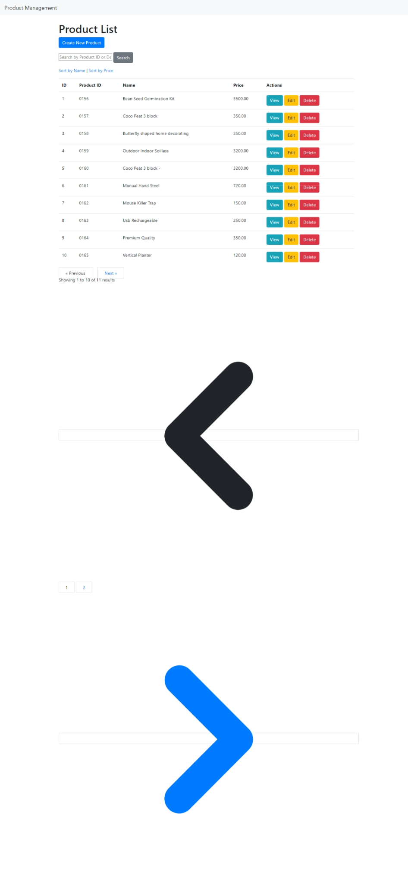

নিম্নলিখিত কোডটি `ProductController` ক্লাসে CRUD অপারেশন সম্পন্ন করার জন্য প্রয়োজনীয় লজিক সহকারে পূর্ণাঙ্গভাবে প্রদান করা হলো:

```php
<?php

namespace App\Http\Controllers;

use App\Models\Product;
use Illuminate\Http\Request;

class ProductController extends Controller {
    /**
     * Display a listing of the resource.
     */
    public function index(Request $request) {
        // Fetch all products with pagination, sorting, and search functionality
        $query = Product::query();

        // Implement sorting by name or price
        if ($request->has('sort_by') && in_array($request->sort_by, ['name', 'price'])) {
            $query->orderBy($request->sort_by);
        }

        // Implement search by product_id or description
        if ($request->has('search')) {
            $query->where('product_id', 'like', '%' . $request->search . '%')
                  ->orWhere('description', 'like', '%' . $request->search . '%');
        }

        $products = $query->paginate(10);

        return view('products.index', compact('products'));
    }

    /**
     * Show the form for creating a new resource.
     */
    public function create() {
        return view('products.create');
    }

    /**
     * Store a newly created resource in storage.
     */
    public function store(Request $request) {
        // Validate request data
        $request->validate([
            'product_id' => 'required|string|unique:products',
            'name' => 'required|string|max:255',
            'description' => 'nullable|string',
            'price' => 'required|numeric',
            'stock' => 'nullable|integer',
            'image' => 'nullable|string',
        ]);

        // Create a new product
        Product::create($request->all());

        return redirect()->route('products.index')->with('success', 'Product created successfully.');
    }

    /**
     * Display the specified resource.
     */
    public function show($id) {
        $product = Product::findOrFail($id);
        return view('products.show', compact('product'));
    }

    /**
     * Show the form for editing the specified resource.
     */
    public function edit($id) {
        $product = Product::findOrFail($id);
        return view('products.edit', compact('product'));
    }

    /**
     * Update the specified resource in storage.
     */
    public function update(Request $request, $id) {
        // Validate request data
        $request->validate([
            'product_id' => 'required|string|unique:products,product_id,' . $id,
            'name' => 'required|string|max:255',
            'description' => 'nullable|string',
            'price' => 'required|numeric',
            'stock' => 'nullable|integer',
            'image' => 'nullable|string',
        ]);

        // Find and update the product
        $product = Product::findOrFail($id);
        $product->update($request->all());

        return redirect()->route('products.index')->with('success', 'Product updated successfully.');
    }

    /**
     * Remove the specified resource from storage.
     */
    public function destroy($id) {
        $product = Product::findOrFail($id);
        $product->delete();

        return redirect()->route('products.index')->with('success', 'Product deleted successfully.');
    }
}
```

### ব্যাখ্যা:

1. **index()**:

    - পেজিনেশন, সর্টিং, এবং সার্চিং এর সাথে সকল প্রোডাক্ট ডেটা ফেচ করা হয়েছে।
    - যদি `sort_by` প্যারামিটার `name` বা `price` হয়, তাহলে সেই অনুসারে প্রোডাক্টগুলোকে সর্ট করা হবে।
    - যদি `search` প্যারামিটার থাকে, তাহলে `product_id` অথবা `description` এর সাথে মিলিয়ে প্রোডাক্টগুলো ফিল্টার করা হবে।

2. **create()**:

    - নতুন প্রোডাক্ট তৈরির ফর্ম দেখানো হয়।

3. **store()**:

    - প্রোডাক্ট ডেটা ভ্যালিডেট করে তা ডাটাবেজে সেভ করা হয়।

4. **show()**:

    - নির্দিষ্ট একটি প্রোডাক্টের বিস্তারিত দেখানো হয়।

5. **edit()**:

    - প্রোডাক্ট এডিট করার ফর্ম দেখানো হয়।

6. **update()**:

    - প্রোডাক্ট ডেটা ভ্যালিডেট করে তা আপডেট করা হয়।

7. **destroy()**:
    - নির্দিষ্ট প্রোডাক্ট ডিলিট করা হয়।

এই কোডটি আপনার টাস্কের চাহিদা অনুযায়ী প্রোডাক্ট ম্যানেজমেন্ট সিস্টেমে সম্পূর্ণ CRUD ফাংশনালিটি প্রদান করবে।

`Product` মডেলটি তৈরি করার জন্য নিম্নলিখিত কোডটি ব্যবহার করতে পারেন। এটি Laravel এ একটি স্ট্যান্ডার্ড মডেল, যেখানে টেবিলের সাথে সম্পর্কিত সমস্ত প্রপার্টি ডিফাইন করা হয়েছে।

প্রথমে Artisan কমান্ড ব্যবহার করে মডেলটি তৈরি করতে পারেন:

```bash
php artisan make:model Product -m
```

এই কমান্ডটি চালালে `Product` মডেলটি `app/Models` ফোল্ডারে তৈরি হবে এবং `create_products_table` নামে একটি মাইগ্রেশন ফাইলও তৈরি হবে, যা আমরা ডাটাবেজ টেবিলের স্ট্রাকচার সেট করতে ব্যবহার করবো।

### Product মডেল (`app/Models/Product.php`):

```php
<?php

namespace App\Models;

use Illuminate\Database\Eloquent\Factories\HasFactory;
use Illuminate\Database\Eloquent\Model;

class Product extends Model
{
    use HasFactory;

    /**
     * The attributes that are mass assignable.
     *
     * @var array<int, string>
     */
    protected $fillable = [
        'product_id',
        'name',
        'description',
        'price',
        'stock',
        'image',
    ];
}
```

### ব্যাখ্যা:

-   `HasFactory` ট্রেইটটি ডাটাবেস ফ্যাক্টরি তৈরি করতে সহায়তা করে।
-   `$fillable` প্রোপার্টি ব্যবহার করে আপনি নির্ধারণ করেছেন কোন ফিল্ডগুলো মডেলের মাধ্যমে ম্যাস অ্যাসাইনেবল (mass assignable) হবে, যা `create()` বা `update()` মেথডের মাধ্যমে নিরাপদে ইনসার্ট বা আপডেট করা যাবে।

### মাইগ্রেশন ফাইলটি সেটআপ করা (`database/migrations/xxxx_xx_xx_create_products_table.php`):

মাইগ্রেশন ফাইলে টেবিলের স্ট্রাকচার সেট করতে হবে। নিচের কোডটি `create_products_table` মাইগ্রেশন ফাইলে যুক্ত করুন:

```php
<?php

use Illuminate\Database\Migrations\Migration;
use Illuminate\Database\Schema\Blueprint;
use Illuminate\Support\Facades\Schema;

class CreateProductsTable extends Migration
{
    /**
     * Run the migrations.
     *
     * @return void
     */
    public function up()
    {
        Schema::create('products', function (Blueprint $table) {
            $table->id();
            $table->string('product_id')->unique();
            $table->string('name');
            $table->text('description')->nullable();
            $table->decimal('price', 8, 2);
            $table->integer('stock')->nullable();
            $table->string('image')->nullable();
            $table->timestamps();
        });
    }

    /**
     * Reverse the migrations.
     *
     * @return void
     */
    public function down()
    {
        Schema::dropIfExists('products');
    }
}
```

### ব্যাখ্যা:

-   `product_id`: একটি ইউনিক স্ট্রিং যা প্রতিটি প্রোডাক্টকে আলাদাভাবে চিহ্নিত করবে।
-   `name`: প্রোডাক্টের নাম।
-   `description`: প্রোডাক্টের বিবরণ (ঐচ্ছিক)।
-   `price`: প্রোডাক্টের মূল্য, যা দশমিক সহ রাখা হয়েছে।
-   `stock`: প্রোডাক্টের স্টক (ঐচ্ছিক)।
-   `image`: প্রোডাক্টের ইমেজের লিঙ্ক বা নাম (ঐচ্ছিক)।
-   `timestamps`: তৈরি এবং আপডেটের সময় রাখার জন্য।

### মাইগ্রেশন চালানো

এখন মাইগ্রেশন চালাতে নিচের কমান্ডটি রান করুন:

```bash
php artisan migrate
```

এতে করে `products` নামে একটি টেবিল তৈরি হবে এবং `Product` মডেলটির সাথে এই টেবিলটি যুক্ত হবে।
আপনার ত্রুটির বার্তা অনুযায়ী, `products` নামে একটি টেবিল ইতোমধ্যে আপনার ডাটাবেসে রয়েছে। Laravel যখন মাইগ্রেশন চালাচ্ছে, তখন এটি নতুন `products` টেবিল তৈরি করতে গিয়ে দ্বৈততা সমস্যার সম্মুখীন হচ্ছে।

এই সমস্যার সমাধানের জন্য নিচের যেকোনো একটি পদ্ধতি অনুসরণ করতে পারেন:

### পদ্ধতি ১: পূর্বে মাইগ্রেটেড টেবিলটি ড্রপ করা

`products` টেবিলটি সরিয়ে পুনরায় মাইগ্রেশন চালানোর জন্য `migrate:refresh` কমান্ড ব্যবহার করতে পারেন, যা টেবিলটি ড্রপ করে পুনরায় তৈরি করবে:

```bash
php artisan migrate:refresh
```

এটি ডাটাবেসের সকল মাইগ্রেশন রোলব্যাক করে পুনরায় চালাবে।

### পদ্ধতি ২: নির্দিষ্ট টেবিল ড্রপ করে পুনরায় মাইগ্রেট করা

যদি শুধুমাত্র `products` টেবিলটি ড্রপ করতে চান, তাহলে MySQL CLI বা phpMyAdmin ব্যবহার করে টেবিলটি ড্রপ করতে পারেন:

```sql
DROP TABLE products;
```

এরপর, পুনরায় মাইগ্রেশন চালান:

```bash
php artisan migrate
```

### পদ্ধতি ৩: মাইগ্রেশন রোলব্যাক করা

এছাড়াও, আপনি পূর্বের মাইগ্রেশনগুলি রোলব্যাক করতে পারেন এবং তারপরে পুনরায় চালাতে পারেন:

```bash
php artisan migrate:rollback
php artisan migrate
```

### পদ্ধতি ৪: `migrate:fresh` কমান্ড ব্যবহার করা

এই কমান্ডটি ডাটাবেসের সকল টেবিল ড্রপ করে এবং মাইগ্রেশনগুলি পুনরায় চালায়:

```bash
php artisan migrate:fresh
```

**সতর্কতা:** `migrate:fresh` কমান্ডটি সকল টেবিল মুছে ফেলবে, তাই ডাটাবেসে কোনো গুরুত্বপূর্ণ ডেটা থাকলে ব্যাকআপ নিয়ে নিন।

এই পদ্ধতিগুলির যেকোনো একটি অনুসরণ করলে সমস্যাটি সমাধান হওয়া উচিত।
আপনার সমস্যাটি সমাধান করতে Laravel এর মাইগ্রেশন এবং ডাটাবেস টেবিল সম্পর্কিত কয়েকটি পদক্ষেপ নিতে হবে। সমস্যাটি হচ্ছে যে Laravel `products` টেবিলটি ড্রপ করতে পারছে না কারণ এটি হয়তো কিছু কারণে আটকে রয়েছে।

এটি ঠিক করতে নিচের নির্দেশনাগুলো অনুসরণ করতে পারেন:

### ১. টেবিলটি সরাসরি ড্রপ করুন

Laravel কমান্ড লাইন থেকে কাজ না করলে, ডাটাবেসের টুল (যেমন phpMyAdmin, MySQL CLI, বা DBeaver) ব্যবহার করে সরাসরি `products` টেবিলটি ড্রপ করতে পারেন।

MySQL কমান্ড:

```sql
DROP TABLE IF EXISTS products;
```

এটি চালানোর পর Laravel এ আবার `php artisan migrate` কমান্ডটি চালান।

### ২. মাইগ্রেশন টেবিল আপডেট করুন

Laravel এর `migrations` টেবিলটি ট্র্যাক রাখে কোন মাইগ্রেশনগুলো ইতোমধ্যেই চালানো হয়েছে। কখনো কখনো এই টেবিলে সমস্যা হতে পারে। ডাটাবেসে গিয়ে `migrations` টেবিলটি থেকে `products` সম্পর্কিত এন্ট্রি মুছে ফেলতে পারেন, তারপর পুনরায় মাইগ্রেশন চালাতে পারেন।

### ৩. `migrate:fresh` কমান্ড ব্যবহার করুন

Laravel এর `migrate:fresh` কমান্ডটি পুরো ডাটাবেসের সকল টেবিল ড্রপ করে এবং সমস্ত মাইগ্রেশন পুনরায় চালায়। তবে সতর্ক থাকুন, এটি ডাটাবেসের সব টেবিল মুছে ফেলে।

```bash
php artisan migrate:fresh
```

এটি প্রয়োগ করার পর আপনার সব মাইগ্রেশন নতুনভাবে চালানো হবে এবং আশা করা যায় যে, এটি `products` টেবিলটি ঠিকভাবে তৈরি করবে।

### ৪. সমস্যা অব্যাহত থাকলে `.env` ফাইল এবং `config:cache` রিফ্রেশ করুন

ডাটাবেসের নাম, ইউজারনেম, বা পাসওয়ার্ড সঠিকভাবে `.env` ফাইলে দেয়া হয়েছে কিনা নিশ্চিত করুন এবং Laravel এর কনফিগারেশন রিফ্রেশ করুন:

```bash
php artisan config:cache
```

এরপর পুনরায় `php artisan migrate` কমান্ডটি চালান।

উপরের নির্দেশনাগুলোর যেকোনো একটি অনুসরণ করলে সমস্যাটি সমাধান হওয়ার কথা।
আপনার জন্য Laravel প্রোজেক্টে প্রয়োজনীয় Blade ফাইলগুলো তৈরি করছি। এই Blade ফাইলগুলোতে আমরা Product Management System-এর জন্য সকল ফর্ম এবং তালিকা দেখানোর পেজগুলো যুক্ত করবো।

প্রত্যেকটি রাউটের জন্য নিচের Blade ফাইলগুলো তৈরি করা হয়েছে:

### ১. `index.blade.php`

এটি `/products` রাউটের জন্য, যেখানে সমস্ত প্রোডাক্ট তালিকাভুক্ত থাকবে। এখানে pagination, sort, এবং search অপশনও যোগ করা হবে।

```blade
<!-- resources/views/products/index.blade.php -->
@extends('layouts.app')

@section('content')
<div class="container">
    <h1>Product List</h1>

    <a href="{{ route('products.create') }}" class="btn btn-primary">Create New Product</a>

    <!-- Search form -->
    <form action="{{ route('products.index') }}" method="GET" class="mt-3">
        <input type="text" name="search" placeholder="Search by Product ID or Description">
        <button type="submit" class="btn btn-secondary">Search</button>
    </form>

    <!-- Sort links -->
    <div class="mt-3">
        <a href="{{ route('products.index', ['sort' => 'name']) }}">Sort by Name</a> |
        <a href="{{ route('products.index', ['sort' => 'price']) }}">Sort by Price</a>
    </div>

    <!-- Product Table -->
    <table class="table mt-3">
        <thead>
            <tr>
                <th>ID</th>
                <th>Product ID</th>
                <th>Name</th>
                <th>Price</th>
                <th>Actions</th>
            </tr>
        </thead>
        <tbody>
            @foreach($products as $product)
            <tr>
                <td>{{ $product->id }}</td>
                <td>{{ $product->product_id }}</td>
                <td>{{ $product->name }}</td>
                <td>{{ $product->price }}</td>
                <td>
                    <a href="{{ route('products.show', $product->id) }}" class="btn btn-info">View</a>
                    <a href="{{ route('products.edit', $product->id) }}" class="btn btn-warning">Edit</a>
                    <form action="{{ route('products.destroy', $product->id) }}" method="POST" style="display:inline;">
                        @csrf
                        @method('DELETE')
                        <button type="submit" class="btn btn-danger">Delete</button>
                    </form>
                </td>
            </tr>
            @endforeach
        </tbody>
    </table>

    <!-- Pagination -->
    {{ $products->links() }}
</div>
@endsection
```

### ২. `create.blade.php`

এটি `/products/create` রাউটের জন্য, যেখানে নতুন প্রোডাক্ট তৈরি করার ফর্ম থাকবে।

```blade
<!-- resources/views/products/create.blade.php -->
@extends('layouts.app')

@section('content')
<div class="container">
    <h1>Create Product</h1>

    <form action="{{ route('products.store') }}" method="POST">
        @csrf
        <div class="form-group">
            <label for="product_id">Product ID</label>
            <input type="text" name="product_id" class="form-control" required>
        </div>

        <div class="form-group">
            <label for="name">Name</label>
            <input type="text" name="name" class="form-control" required>
        </div>

        <div class="form-group">
            <label for="price">Price</label>
            <input type="number" name="price" class="form-control" required step="0.01">
        </div>

        <div class="form-group">
            <label for="description">Description</label>
            <textarea name="description" class="form-control"></textarea>
        </div>

        <div class="form-group">
            <label for="stock">Stock</label>
            <input type="number" name="stock" class="form-control">
        </div>

        <button type="submit" class="btn btn-primary">Save Product</button>
    </form>
</div>
@endsection
```

### ৩. `edit.blade.php`

এটি `/products/{id}/edit` রাউটের জন্য, যেখানে প্রোডাক্ট এডিট করার ফর্ম থাকবে।

```blade
<!-- resources/views/products/edit.blade.php -->
@extends('layouts.app')

@section('content')
<div class="container">
    <h1>Edit Product</h1>

    <form action="{{ route('products.update', $product->id) }}" method="POST">
        @csrf
        @method('PUT')

        <div class="form-group">
            <label for="product_id">Product ID</label>
            <input type="text" name="product_id" class="form-control" value="{{ $product->product_id }}" required>
        </div>

        <div class="form-group">
            <label for="name">Name</label>
            <input type="text" name="name" class="form-control" value="{{ $product->name }}" required>
        </div>

        <div class="form-group">
            <label for="price">Price</label>
            <input type="number" name="price" class="form-control" value="{{ $product->price }}" required step="0.01">
        </div>

        <div class="form-group">
            <label for="description">Description</label>
            <textarea name="description" class="form-control">{{ $product->description }}</textarea>
        </div>

        <div class="form-group">
            <label for="stock">Stock</label>
            <input type="number" name="stock" class="form-control" value="{{ $product->stock }}">
        </div>

        <button type="submit" class="btn btn-primary">Update Product</button>
    </form>
</div>
@endsection
```

### ৪. `show.blade.php`

এটি `/products/{id}` রাউটের জন্য, যেখানে একটি নির্দিষ্ট প্রোডাক্টের ডিটেইলস দেখানো হবে।

```blade
<!-- resources/views/products/show.blade.php -->
@extends('layouts.app')

@section('content')
<div class="container">
    <h1>Product Details</h1>

    <div>
        <strong>Product ID:</strong> {{ $product->product_id }}
    </div>
    <div>
        <strong>Name:</strong> {{ $product->name }}
    </div>
    <div>
        <strong>Price:</strong> {{ $product->price }}
    </div>
    <div>
        <strong>Description:</strong> {{ $product->description }}
    </div>
    <div>
        <strong>Stock:</strong> {{ $product->stock }}
    </div>

    <a href="{{ route('products.index') }}" class="btn btn-secondary">Back to List</a>
</div>
@endsection
```

### অতিরিক্ত: `layouts.app` টেমপ্লেট

সকল Blade ফাইলগুলোর জন্য একটি সাধারণ লেআউট ফাইল প্রয়োজন। এটি একটি বেস টেমপ্লেট হিসেবে কাজ করবে।

```blade
<!-- resources/views/layouts/app.blade.php -->
<!DOCTYPE html>
<html lang="en">
<head>
    <meta charset="UTF-8">
    <meta name="viewport" content="width=device-width, initial-scale=1.0">
    <title>Product Management System</title>
    <link rel="stylesheet" href="https://cdnjs.cloudflare.com/ajax/libs/twitter-bootstrap/4.5.2/css/bootstrap.min.css">
</head>
<body>
    <nav class="navbar navbar-expand-lg navbar-light bg-light">
        <a class="navbar-brand" href="{{ route('products.index') }}">Product Management</a>
    </nav>

    <div class="container mt-4">
        @yield('content')
    </div>
</body>
</html>
```

এই Blade ফাইলগুলো Laravel প্রজেক্টের `resources/views` ফোল্ডারে যথাযথ নাম দিয়ে সংরক্ষণ করুন। এখন আপনার Product Management System-এর জন্য সকল ভিউ ফাইল তৈরি হয়ে গেছে।

আপনাকে `ProductController` এবং অন্যান্য ফাইলগুলোর প্রয়োজনীয় পরিবর্তন করে দিচ্ছি, যাতে তৈরি করা Blade ফাইলগুলো ঠিকভাবে কাজ করে। আমরা এখানে `ProductController`-এর প্রতিটি মেথড এবং মডেল, রাউট ইত্যাদি সংযোজন করব।

### `ProductController`

প্রথমে `ProductController`-এ CRUD অপারেশনের জন্য প্রয়োজনীয় সকল মেথড পরিবর্তন করবো।

```php
<?php

namespace App\Http\Controllers;

use App\Models\Product;
use Illuminate\Http\Request;

class ProductController extends Controller {
    /**
     * Display a listing of the resource.
     */
    public function index(Request $request) {
        // Search and sorting logic
        $query = Product::query();

        // Searching by product_id or description
        if ($request->has('search')) {
            $search = $request->input('search');
            $query->where('product_id', 'like', "%$search%")
                  ->orWhere('description', 'like', "%$search%");
        }

        // Sorting by name or price
        if ($request->has('sort')) {
            $sort = $request->input('sort');
            $query->orderBy($sort);
        }

        $products = $query->paginate(10);

        return view('products.index', compact('products'));
    }

    /**
     * Show the form for creating a new resource.
     */
    public function create() {
        return view('products.create');
    }

    /**
     * Store a newly created resource in storage.
     */
    public function store(Request $request) {
        $request->validate([
            'product_id' => 'required|unique:products',
            'name' => 'required',
            'price' => 'required|numeric',
        ]);

        Product::create($request->all());

        return redirect()->route('products.index')->with('success', 'Product created successfully.');
    }

    /**
     * Display the specified resource.
     */
    public function show($id) {
        $product = Product::findOrFail($id);
        return view('products.show', compact('product'));
    }

    /**
     * Show the form for editing the specified resource.
     */
    public function edit($id) {
        $product = Product::findOrFail($id);
        return view('products.edit', compact('product'));
    }

    /**
     * Update the specified resource in storage.
     */
    public function update(Request $request, $id) {
        $request->validate([
            'product_id' => 'required|unique:products,product_id,' . $id,
            'name' => 'required',
            'price' => 'required|numeric',
        ]);

        $product = Product::findOrFail($id);
        $product->update($request->all());

        return redirect()->route('products.index')->with('success', 'Product updated successfully.');
    }

    /**
     * Remove the specified resource from storage.
     */
    public function destroy($id) {
        $product = Product::findOrFail($id);
        $product->delete();

        return redirect()->route('products.index')->with('success', 'Product deleted successfully.');
    }
}
```

### Model: `Product`

`Product` মডেলটি সঠিকভাবে কাজ করার জন্য পরিবর্তন করা হচ্ছে। নিশ্চিত হতে হলে `fillable` প্রোপার্টি সংযোজন করতে হবে।

```php
<?php

namespace App\Models;

use Illuminate\Database\Eloquent\Factories\HasFactory;
use Illuminate\Database\Eloquent\Model;

class Product extends Model
{
    use HasFactory;

    protected $fillable = [
        'product_id',
        'name',
        'description',
        'price',
        'stock',
        'image',
    ];
}
```

### Routes: `web.php`

`web.php`-তে প্রয়োজনীয় রাউট সংযোজন করুন, যাতে কন্ট্রোলারের প্রতিটি মেথড ঠিকমতো কাজ করে।

```php
use App\Http\Controllers\ProductController;

Route::resource('products', ProductController::class);
```

### Flash Message in Layout

এছাড়াও, `layouts/app.blade.php` টেমপ্লেটে Flash Message যোগ করা যেতে পারে, যাতে অপারেশন সফল হলে ইউজারকে মেসেজ দেখানো যায়।

```blade
<!-- resources/views/layouts/app.blade.php -->
<!DOCTYPE html>
<html lang="en">
<head>
    <meta charset="UTF-8">
    <meta name="viewport" content="width=device-width, initial-scale=1.0">
    <title>Product Management System</title>
    <link rel="stylesheet" href="https://cdnjs.cloudflare.com/ajax/libs/twitter-bootstrap/4.5.2/css/bootstrap.min.css">
</head>
<body>
    <nav class="navbar navbar-expand-lg navbar-light bg-light">
        <a class="navbar-brand" href="{{ route('products.index') }}">Product Management</a>
    </nav>

    <div class="container mt-4">
        @if(session('success'))
            <div class="alert alert-success">
                {{ session('success') }}
            </div>
        @endif

        @yield('content')
    </div>
</body>
</html>
```

### Database Migration (Already Done)

আপনার `products` টেবিলটি মাইগ্রেট করার জন্য কমান্ড চালানো হয়েছিল এবং এটি সফল হয়েছে। যদি কোনো সমস্যা থেকে থাকে, তাহলে `php artisan migrate:refresh` ব্যবহার করতে পারেন।

### Quick Summary

আপনার Laravel প্রজেক্টটি এখন নিচের ফিচারগুলোর সাথে সম্পূর্ণ:

1. **Product CRUD Operations** - কন্ট্রোলার, ভিউ এবং মডেল মিলে কাজ করবে।
2. **Sorting & Search** - নাম এবং প্রাইস দ্বারা sort এবং search করা যাবে।
3. **Flash Messages** - অপারেশন সফল হলে সফলতার মেসেজ দেখাবে।

এখন প্রজেক্টটি রানের জন্য প্রস্তুত, `php artisan serve` দিয়ে সার্ভার চালিয়ে দেখুন এবং সবকিছু ঠিকভাবে কাজ করছে কিনা যাচাই করুন।
আপনার মাইগ্রেশন সফলভাবে চলেছে। এখন আপনি আপনার অ্যাপটি চালিয়ে দেখতে পারেন যে, তৈরি করা `ProductController`, মডেল, এবং ভিউগুলো সঠিকভাবে কাজ করছে কিনা।

Laravel সার্ভার চালানোর জন্য `php artisan serve` কমান্ডটি ব্যবহার করুন:

```bash
php artisan serve
```

এরপর আপনার ব্রাউজারে `http://127.0.0.1:8000/products` এ গিয়ে আপনার প্রজেক্টের CRUD অপারেশনগুলো যাচাই করতে পারেন।

### চেকলিস্ট:

1. **Product List View** - `GET /products` এ প্রোডাক্ট তালিকা দেখুন।
2. **Create Product** - `GET /products/create` এ নতুন প্রোডাক্ট তৈরি করুন।
3. **Edit Product** - প্রতিটি প্রোডাক্টের পাশে থাকা Edit বাটনে ক্লিক করে এডিট করে দেখুন।
4. **Delete Product** - প্রোডাক্ট মুছে দেখুন।
5. **Sort and Search** - `index.blade.php` পেইজে Sort ও Search অপশন যাচাই করুন।

আপনার অ্যাপটি সফলভাবে কাজ করছে কিনা জানাতে পারেন।
আপনার স্ক্রিনশট অনুযায়ী, `products.create` ভিউটি পাওয়া যাচ্ছে না। এর কারণ হতে পারে `create.blade.php` ফাইলটি `resources/views/products/` ডিরেক্টরিতে সঠিকভাবে নেই।

সমস্যাটি সমাধান করতে নিচের পদক্ষেপগুলো অনুসরণ করুন:

1. **ফাইলের অবস্থান চেক করুন:**
   নিশ্চিত করুন যে `create.blade.php` ফাইলটি `resources/views/products/` ফোল্ডারে আছে। যদি না থাকে, তবে এই ফোল্ডারে একটি ফাইল তৈরি করুন এবং তার নাম দিন `create.blade.php`।

2. **create.blade.php ফাইলের কন্টেন্ট:**
   নিচে একটি নমুনা `create.blade.php` এর কন্টেন্ট দেয়া হলো। এটি প্রোডাক্ট তৈরি করার ফর্ম হিসেবে কাজ করবে।

    ```blade
    <!-- resources/views/products/create.blade.php -->

    <!DOCTYPE html>
    <html>
    <head>
        <title>Create Product</title>
    </head>
    <body>
        <h1>Create a New Product</h1>
        <form action="{{ route('products.store') }}" method="POST" enctype="multipart/form-data">
            @csrf
            <label for="product_id">Product ID:</label>
            <input type="text" name="product_id" required><br><br>

            <label for="name">Name:</label>
            <input type="text" name="name" required><br><br>

            <label for="description">Description:</label>
            <textarea name="description"></textarea><br><br>

            <label for="price">Price:</label>
            <input type="number" step="0.01" name="price" required><br><br>

            <label for="stock">Stock:</label>
            <input type="number" name="stock"><br><br>

            <label for="image">Image:</label>
            <input type="file" name="image"><br><br>

            <button type="submit">Create Product</button>
        </form>
    </body>
    </html>
    ```

3. **কন্ট্রোলার মেথডে ভিউ কল করুন:**
   নিশ্চিত করুন যে `ProductController`-এ `create` মেথডে সঠিক ভিউ কল করা হয়েছে:

    ```php
    public function create() {
        return view('products.create');
    }
    ```

4. **রুট চেক করুন:**
   রুটটি নিশ্চিত করুন যে এটি সঠিকভাবে কনফিগার করা আছে এবং `GET /products/create` ঠিকঠাক কাজ করছে।

    ```php
    Route::get('/products/create', [ProductController::class, 'create'])->name('products.create');
    ```

এই ধাপগুলো অনুসরণ করার পর ব্রাউজারে `http://127.0.0.1:8000/products/create` গিয়ে আবার চেষ্টা করুন। আশা করি এখন `create` ভিউটি লোড হবে।
`index.blade.php` ফাইলে পেজিনেশন যুক্ত করার জন্য, আপনাকে Laravel এর পেজিনেশন ফাংশন `links()` ব্যবহার করতে হবে। যদি আপনার `ProductController`-এর `index` মেথডে পেজিনেশন সঠিকভাবে সেট করা থাকে, তবে Blade টেমপ্লেটে পেজিনেশন লিঙ্কগুলো দেখানোর জন্য `links()` ব্যবহার করা যেতে পারে।

নিচে `index.blade.php`-তে পেজিনেশন যুক্ত করার একটি উদাহরণ দেয়া হলো:

### Step 1: Controller-এ পেজিনেশন সেট করা

`ProductController` এর `index` মেথডে `paginate()` ব্যবহার করে পেজিনেশন সেট করুন:

```php
public function index(Request $request) {
    $query = Product::query();

    // Optional: Sorting by name or price
    if ($request->has('sort')) {
        $sortBy = $request->get('sort');
        $query->orderBy($sortBy);
    }

    // Pagination with 10 products per page
    $products = $query->paginate(10);

    return view('products.index', compact('products'));
}
```

এখানে `paginate(10)` দিয়ে আমরা এক পেজে ১০টি প্রোডাক্ট দেখানোর নির্দেশ দিয়েছি।

### Step 2: Blade ফাইলে পেজিনেশন লিঙ্ক যুক্ত করা

`index.blade.php` ফাইলের নিচের দিকে পেজিনেশন লিঙ্ক যুক্ত করতে পারেন:

```blade
<!-- resources/views/products/index.blade.php -->

<!DOCTYPE html>
<html>
<head>
    <title>Product List</title>
</head>
<body>
    <h1>All Products</h1>

    <!-- Table of products -->
    <table>
        <tr>
            <th>ID</th>
            <th>Product ID</th>
            <th>Name</th>
            <th>Price</th>
            <th>Stock</th>
            <th>Actions</th>
        </tr>
        @foreach ($products as $product)
        <tr>
            <td>{{ $product->id }}</td>
            <td>{{ $product->product_id }}</td>
            <td>{{ $product->name }}</td>
            <td>{{ $product->price }}</td>
            <td>{{ $product->stock }}</td>
            <td>
                <a href="{{ route('products.show', $product->id) }}">View</a> |
                <a href="{{ route('products.edit', $product->id) }}">Edit</a> |
                <form action="{{ route('products.destroy', $product->id) }}" method="POST" style="display:inline;">
                    @csrf
                    @method('DELETE')
                    <button type="submit" onclick="return confirm('Are you sure?')">Delete</button>
                </form>
            </td>
        </tr>
        @endforeach
    </table>

    <!-- Pagination links -->
    <div class="pagination">
        {{ $products->links() }}
    </div>
</body>
</html>
```

### Note:

-   `{{ $products->links() }}` কোডটি Laravel এর ডিফল্ট পেজিনেশন লিঙ্ক তৈরি করবে। এটি HTML টেবিলের নিচে পেজিনেশন লিঙ্কগুলো দেখাবে।
-   আপনি পেজিনেশন স্টাইল কাস্টমাইজ করতে চাইলে, Laravel এর ডকুমেন্টেশনে [Custom Pagination](https://laravel.com/docs/8.x/pagination#customizing-the-pagination-view) দেখতে পারেন।

এভাবে `index.blade.php` ফাইলটি সম্পূর্ণ হবে, এবং পেজিনেশন লিঙ্কগুলো ঠিকঠাক কাজ করবে।


এই অপ্রয়োজনীয় চিহ্নগুলো Laravel পেজিনেশন লিংকের `links()` ফাংশনের মাধ্যমে আসে, যা Bootstrap বা TailwindCSS এর মতো CSS ফ্রেমওয়ার্ক অনুযায়ী স্টাইল করা থাকে। তবে কিছু ক্ষেত্রে অতিরিক্ত চিহ্ন প্রদর্শিত হতে পারে, বিশেষ করে যদি CSS ঠিকমতো লোড না হয় বা কাস্টম স্টাইল কনফ্লিক্ট করে।

এই চিহ্ন সরানোর জন্য নিচের কয়েকটি সমাধান চেষ্টা করতে পারেন:

### ১. পেজিনেশন কনফিগারেশন চেক করুন

`resources/views/products/index.blade.php` ফাইলে `{{ $products->links() }}` লাইনটি আপডেট করে পেজিনেশনকে নির্দিষ্ট টেমপ্লেট দিয়ে রেন্ডার করার চেষ্টা করুন:

```blade
{{ $products->links('pagination::bootstrap-4') }}
```

### ২. Bootstrap পেজিনেশন ক্লাস অ্যাড করুন

যদি আপনি Bootstrap ব্যবহার করেন তবে নিশ্চিত করুন যে Bootstrap সঠিকভাবে লোড হয়েছে। যদি TailwindCSS ব্যবহার করেন, তাহলে সেটার জন্যও প্রপার কনফিগারেশন নিশ্চিত করুন।

### ৩. কাস্টম পেজিনেশন ভিউ তৈরি করুন

আপনি পেজিনেশন লিংক কাস্টমাইজ করতে চাইলে Laravel এর পেজিনেশন ভিউ ওভাররাইড করে একটি নতুন ভিউ তৈরি করতে পারেন।

১. `resources/views/vendor/pagination/` এই ডিরেক্টরিতে `bootstrap-4.blade.php` কপি করুন। যদি এই ডিরেক্টরি না থাকে, তবে `php artisan vendor:publish --tag=laravel-pagination` কমান্ড রান করুন।
২. এর পরে, আপনি সেই ফাইলটি কাস্টমাইজ করতে পারেন এবং অপ্রয়োজনীয় চিহ্ন সরাতে পারেন।

এভাবে করা হলে অপ্রয়োজনীয় চিহ্নগুলো আর দেখা যাবে না।
